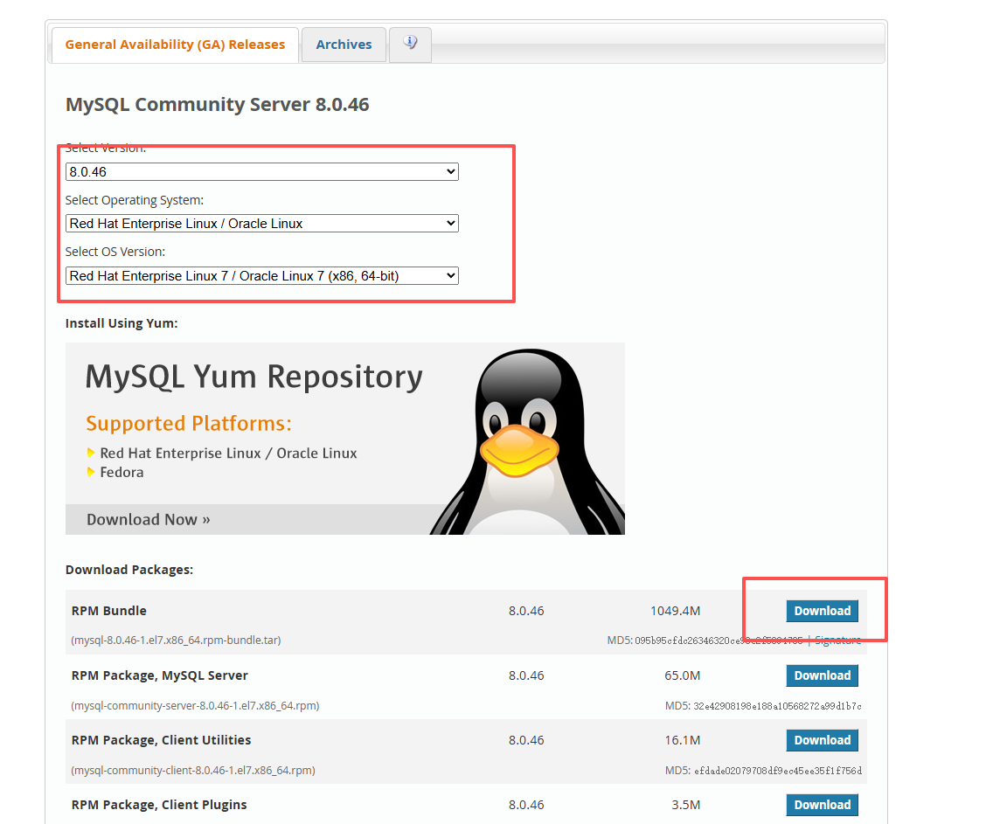

[https://gitee.com/zwhddup/mysql-learning/blob/master/%E5%B0%9A%E7%A1%85%E8%B0%B7%E8%A7%86%E9%A2%91%E8%80%81%E5%B8%88%E7%AC%94%E8%AE%B0/mysql%E9%AB%98%E7%BA%A7%E7%AF%87%E7%AC%94%E8%AE%B0/%E7%AC%AC02%E7%AB%A0%20MySQL%E7%9A%84%E6%95%B0%E6%8D%AE%E7%9B%AE%E5%BD%95.md#1-mysql8%E7%9A%84%E4%B8%BB%E8%A6%81%E7%9B%AE%E5%BD%95%E7%BB%93%E6%9E%84](https://gitee.com/zwhddup/mysql-learning/blob/master/尚硅谷视频老师笔记/mysql高级篇笔记/第02章 MySQL的数据目录.md#1-mysql8的主要目录结构)


# 一、Linux下MySQL的安装与使用

## 1、安装前说明

### 1.1 查看是否安装过MySQL

- 如果是用rpm安装, 检查一下RPM PACKAGE：

~~~bash
# -i 忽略大小写
rpm -qa | grep -i mysql 
~~~

- 检查mysql service：

~~~bash
systemctl status mysqld.service
~~~


### 1.2 MySQL的卸载

- **1、关闭** **MySQL** **服务**

~~~bash
systemctl stop mysqld.service
~~~

- **2、查看当前** **MySQL** **安装状况**

~~~bash
rpm -qa | grep -i mysql
# 或
yum list installed | grep mysql
~~~

- **3、卸载上述命令查询出的已安装程序**
  - 务必卸载干净，反复执行 <font color="red">**rpm -qa | grep -i mysql**</font> 确认是否有卸载残留

~~~bash
yum remove mysql-xxx mysql-xxx mysql-xxx 
yum remove mysql-*
rpm -qa | grep -i mysql|xargs yum remove -y
~~~

- **4、删除** **MySQL** **相关文件**

  - 查找相关文件

  ~~~bash
  # 注意不要误删
  
  # 找出文件名为 mysql 的所有文件或目录
  find / -name mysql
  # 找出文件名包含 mysql 的所有文件或目录
  # * 是通配符，代表任意字符
  find / -name '*mysql*'
  ~~~

  - 删除上述命令查找出的相关文件

  ~~~bash
  rm -rf xxx
  # 容易误删,不要使用此命令
  find / -name mysql|xargs rm -rf
  ~~~

- **5、删除 my.cnf**

~~~bash
rm -rf /etc/my.cnf
~~~

- 6、**常见需要删除的目录和文件**
  - <b>数据目录</b> 通常是 /var/lib/mysql/，包含 MySQL 数据库的数据文件
  - **配置文件** 包括但不限于 /etc/my.cnf 和 /etc/mysql/ 目录下的配置文件
  - <b>日志文件</b> MySQL 日志文件通常存储在 /var/log/mysql/ 目录下
  - <b>临时文件</b> MySQL 可能会在运行时创建临时文件，这些文件可能存储在 /tmp/ 目录下或其他指定的临时目录中
  - <b>启动脚本</b> 如果使用的是 systemd，可能需要删除位于 /etc/systemd/system/ 目录下的 MySQL 启动脚本
  - <b>用户和组</b> 如果安装 MySQL 时创建了专用的用户和组，可能需要删除这些用户和组。


### 1.3 MySQL的安装方式

- **方式一：rpm命令安装**

  - 使用rpm命令安装扩展名为.rpm的软件包。


  - .rpm包的一般格式：


- **方式二：yum命令**
  - 需联网，从互联网获取的yum源，直接使用yum命令安装。


- **方式三：编译安装源码包**
  - 针对tar.gz 这样的压缩格式，要用tar命令来解压；如果是其它压缩格式，就使用其它命令。


| 安装方式       | 特点                                                 |
| -------------- | ---------------------------------------------------- |
| rpm            | 安装简单，灵活性差，无法灵活选择版本、升级           |
| rpm repository | 安装包极小，版本安装简单灵活，升级方便，需要联网安装 |
| 通用二进制     | 包安装比较复杂，灵活性高，平台通用性好               |
| 源码包         | 安装最复杂，时间长，参数设置灵活，性能好             |


## 2、rpm包方式安装

### 2.1 下载rpm包

- **通过网页下载，上传到服务器**

  - 下载地址：https://dev.mysql.com/downloads/mysql/

  - 这里不能直接选择CentOS系统的版本，所以选择与之对应的Red Hat Enterprise Linux

  - 直接点Download下载RPM Bundle全量包。包括了所有下面的组件。不需要一个一个下载了

  

- **直接通过wget下载**

  - wget下载链接来自于官网的下载页面，点击下载，复制下载链接得来

  ~~~bash
  mkdir /opt/mysql
  cd /opt/mysql
  
  #下载mysql安装包
  wget https://cdn.mysql.com/archives/mysql-8.0/mysql-8.0.46-1.el8.x86_64.rpm-bundle.tar
  wget https://cdn.mysql.com/archives/mysql-5.7/mysql-5.7.26-1.el7.x86_64.rpm-bundle.tar
  tar -xvf mysql-5.7.26-1.el7.x86_64.rpm-bundle.tar
  
  # 软件名mysql 版本号 5.7.26
  # 发布次数1 系统版本el7 硬件平台 x86_64
  ~~~


### 2.2 检查MySQL依赖

- **检查/tmp临时目录权限（必不可少）**、
  - 由于mysql安装过程中，会通过mysql用户在/tmp目录下新建tmp_db文件，所以请给/tmp较大的权限。执行 ：

~~~bash
chmod -R 777 /tmp
~~~

- **安装前，检查依赖**

~~~bash
rpm -qa|grep libaio
# 执行结果：libaio-0.3.109-13.el7.x86_64
rpm -qa|grep net-tools
# 执行结果：net-tools-2.0-0.25.20131004git.el7.x86_64
~~~

- **可能缺失的依赖**
  - libaio net-tools ncurses-compat-libs perl-interpreter
  - 缺少依赖文件，可以通过以下命令查找安装


~~~bash
yum provides <缺失的文件名>
# 安装缺失的依赖
yum install xxx
~~~


### 2.3 RPM包介绍

- mysql-community-client.rpm：MySQL 客户端软件包，用于连接到 MySQL 服务器并执行 SQL 查询和管理数据库。

- mysql-community-common.rpm：MySQL 的共享文件，包含了所有 MySQL 安装中共享的文件。

- mysql-community-devel.rpm：MySQL 开发文件，包含了用于编译和开发 MySQL 应用程序的头文件和库文件。

- mysql-community-embedded.rpm：MySQL 嵌入式服务器，适用于嵌入式应用程序和特殊用途场景。

- mysql-community-embedded-compat.rpm：MySQL 嵌入式兼容库，与嵌入式服务器一起使用。

- mysql-community-embedded-devel.rpm：MySQL 嵌入式开发文件，用于开发嵌入式应用程序。

- mysql-community-libs.rpm 包含 MySQL 客户端和服务器所需的共享库文件。这些共享库文件包括了 MySQL的核心功能和支持文件

- mysql-community-libs-compat.rpm：MySQL 客户端库的兼容库。兼任旧版本的MySQL库。

- mysql-community-server.rpm：MySQL 服务器软件包，用于安装和运行 MySQL 数据库服务器。

- mysql-community-test.rpm：MySQL 测试套件，用于测试 MySQL 服务器的性能和功能。


### 2.4 MySQL安装过程

- 解压后需要抽出几个文件，上传到linux上的 /opt/mysql下

~~~bash
mysql-community-client-8.0.46-1.el7.x86_64.rpm
mysql-community-client-plugins-8.0.46-1.el7.x86_64.rpm
mysql-community-common-8.0.46-1.el7.x86_64.rpm
mysql-community-icu-data-files-8.0.46-1.el7.x86_64.rpm
mysql-community-libs-8.0.46-1.el7.x86_64.rpm
mysql-community-server-8.0.46-1.el7.x86_64.rpm
~~~

- 在mysql的安装文件目录下执行：（必须按照顺序执行）
  - rpm 是Redhat Package Manage缩写，通过RPM的管理，用户可以把源代码包装成以rpm为扩展名的文件形式，易于安装。
  - -i, --install 安装软件包
  - -v, --verbose 提供更多的详细信息输出
  - -h, --hash 软件包安装的时候列出哈希标记 (和 -v 一起使用效果更好)，展示进度条
  - 若存在mariadb-libs问题，则执行<font color="red">**yum remove mysql-libs**</font>即可

~~~bash
rpm -ivh mysql-community-common-8.0.46-1.el7.x86_64.rpm
rpm -ivh mysql-community-client-plugins-8.0.46-1.el7.x86_64.rpm
# 第三个包装的时候会报错：mariadb-libs is obsoleted by mysql-community-libs
# 原因：CentOS7 默认自带 mariadb 库，和 MySQL8 的 libs 包冲突，必须先删掉 mariadb-libs
# 安装第三个包前先执行：yum remove mariadb-libs -y
rpm -ivh mysql-community-libs-8.0.46-1.el7.x86_64.rpm
rpm -ivh mysql-community-client-8.0.46-1.el7.x86_64.rpm
rpm -ivh mysql-community-icu-data-files-8.0.46-1.el7.x86_64.rpm
rpm -ivh mysql-community-server-8.0.46-1.el7.x86_64.rpm
~~~

- 注意：安装时会报错，warning: mysql-community-server-8.0.46-1.el7.x86_64.rpm: Header V4 RSA/SHA256 Signature, key ID a8d3785c: NOKEY
  - NOKEY 只是**签名密钥警告**，不是报错，不影响安装。含义：系统没有导入 MySQL 的 GPG 公钥，无法校验 rpm 包签名
  - 可以加 --nodeps --force 或者提前导入公钥消除警告
  - rpm --import https://repo.mysql.com/RPM-GPG-KEY-mysql-2022


### 2.5 查看MySQL版本

~~~bash
mysql --version 
#或
mysqladmin --version
## 输出：mysql  Ver 8.0.46 for Linux on x86_64 (MySQL Community Server - GPL)
~~~


### 2.6 服务的初始化

- 为了保证数据库目录与文件的所有者为 mysql 登录用户，如果你是以 root 身份运行 mysql 服务，需要执行下面的命令初始化：

~~~bash
mysqld --initialize --user=mysql
~~~

- 说明： --initialize 选项默认以“安全”模式来初始化，则会为 root 用户生成一个密码并将该密码标记为过期，登录后你需要设置一个新的密码。生成的临时密码会往日志中记录一份
- 查看密码

~~~bash
cat /var/log/mysqld.log
~~~

- root@localhost: 后面就是初始化的密码

~~~bash
[root@VM-0-8-centos opt]# mysqld --initialize --user=mysql
[root@VM-0-8-centos opt]# cat /var/log/mysqld.log
2026-06-14T08:52:06.090704Z 0 [System] [MY-013169] [Server] /usr/sbin/mysqld (mysqld 8.0.46) initializing of server in progress as process 4263
2026-06-14T08:52:06.103066Z 1 [System] [MY-013576] [InnoDB] InnoDB initialization has started.
2026-06-14T08:52:07.463670Z 1 [System] [MY-013577] [InnoDB] InnoDB initialization has ended.
2026-06-14T08:52:09.939303Z 6 [Note] [MY-010454] [Server] A temporary password is generated for root@localhost: X?95hccb+-km
~~~


### 2.7 启动MySQL，查看状态

~~~bash
#加不加.service后缀都可以 
启动：systemctl start mysqld.service 
关闭：systemctl stop mysqld.service 
重启：systemctl restart mysqld.service 
查看状态：systemctl status mysqld.service
~~~


### 2.8 **查看MySQL服务是否自启动**

- 查看命令：systemctl list-unit-files|grep mysqld.service

~~~bash
[root@VM-0-8-centos opt]# systemctl list-unit-files|grep mysqld.service
mysqld.service                                enabled 
~~~

- 如不是enabled可以运行如下命令设置自启动

~~~bash
systemctl enable mysqld.service
~~~

- 如果希望不进行自启动，运行如下命令设置

~~~bash
systemctl disable mysqld.service
~~~


## 3、**MySQL登录**

### 3.1 **首次登录**

- 通过 mysql -hlocalhost -P3306 -uroot -p 进行登录，在Enter password：录入初始化密码

~~~bash
mysql -hlocalhost -P3306 -uroot -p
~~~


### 3.2 **修改密码**

~~~bash
ALTER USER 'root'@'localhost' IDENTIFIED BY 'li998813';
~~~


### 3.3 **设置远程登录**

- **确认网络**

  - 在远程机器上使用ping ip地址保证网络畅通
  - 在远程机器上使用telnet命令保证端口号开放访问

- **关闭防火墙或开放端口**

  - **方式一：关闭防火墙**

  ~~~bash
  #开启防火墙
  systemctl start firewalld.service
  #查看防火墙状态
  systemctl status firewalld.service
  #关闭防火墙
  systemctl stop firewalld.service
  #设置开机启用防火墙 
  systemctl enable firewalld.service 
  #设置开机禁用防火墙 
  systemctl disable firewalld.service
  ~~~

  - **方式二：开放端口**

  ~~~bash
  # 查看开放的端口号
  firewall-cmd --list-all
  
  # 设置开放的端口号
  firewall-cmd --add-service=http --permanent
  firewall-cmd --add-port=3306/tcp --permanent
  
  # 重启防火墙
  firewall-cmd --reload
  ~~~


## 4、MySQL8密码强度评估

### 4.1 设置密码报错

- MySQL8.0设置密码报错

~~~bash
ALTER USER 'root'@'localhost' IDENTIFIED BY '12345678';
# ERROR 1819 (HY000): Your password does not satisfy the current policy requirements
~~~


### 4.2 MySQL8之前的安全策略

- 在MySQL8.0之前，MySQL使用的是validate_password插件检测、验证账号密码强度，报障账号的安全性
- <font color="red">**检查插件是否安装：SHOW PLUGINS;**</font>
  - 查找validate_password插件的Status列，看看它是否为ACTIVE
- <font color="red">**安装/启用插件方式1：在参数文件 my.cnf 中添加参数**</font>

~~~bash

~~~


## 4、**Linux下修改配置**

- 修改允许远程登陆

~~~bash
use mysql;
select Host,User from user;
update user set host = '%' where user ='root';
flush privileges;
~~~

- %是个 通配符 ，如果Host=192.168.1.%，那么就表示只要是IP地址前缀为“192.168.1.”的客户端都可以连接。如果Host=%，表示所有IP都有连接权限。
- 注意：<font color="red">**在生产环境下不能为了省事将host设置为%，这样做会存在安全问题，具体的设置可以根据生产环境的IP进行设置**</font>

- 配置新连接报错：错误号码 2058，分析是 mysql 密码加密方法变了

  - **解决方法一：**升级远程连接工具版本
  - **解决方法二：**

  ~~~bash
  ALTER USER 'root'@'%' IDENTIFIED WITH mysql_native_password BY 'li998813';
  ~~~


## 5、**字符集的相关操作**

~~~bash
show variables like 'character%';
~~~

- character_set_server：服务器级别的字符集
- character_set_database：当前数据库的字符集
- character_set_client：服务器解码请求时使用的字符集
- character_set_connection：服务器处理请求时会把请求字符串从character_set_client转为character_set_connection
- character_set_results：服务器向客户端返回数据时使用的字符集

- **小结**

  - 如果创建或修改列时没有显式的指定字符集和比较规则，则该列默认用表的字符集和比较规则

  - 如果创建表时没有显式的指定字符集和比较规则，则该表默认用数据库的字符集和比较规则

  - 如果创建数据库时没有显式的指定字符集和比较规则，则该数据库默认用服务器的字符集和比较规则


# 二、MySQL的数据目录

## 1. MySQL8的主要目录结构

```shell
find / -name mysql

/opt/mysql
/etc/selinux/targeted/active/modules/100/mysql
/etc/logrotate.d/mysql
/usr/bin/mysql
/usr/lib64/mysql
/var/lib/mysql
/var/lib/mysql/mysql
```

- 文件目录

  - **程序二进制 / 客户端**：/usr/bin/mysql、/usr/lib64/mysql

  - **数据库数据（核心）**：/var/lib/mysql

  - **系统权限库**：/var/lib/mysql/mysql

  - **日志自动切割**：/etc/logrotate.d/mysql

  - **SELinux 安全策略**：/etc/selinux/targeted/active/modules/100/mysql

  - /opt/mysql：非默认，多为手动二进制包使用

  - /etc/my.cnf 主配置文件

  - /var/log/mysql 日志目录（部分版本在 datadir 里面）

  - /usr/sbin/mysqld MySQL 服务主进程


### 1.1 数据库文件的存放路径

**MySQL数据库文件的存放路径：/var/lib/mysql**

数据目录对应系统变量datadir

```mysql
show variables like 'datadir';
+---------------+-----------------+
| Variable_name | Value           |
+---------------+-----------------+
| datadir       | /var/lib/mysql/ |
+---------------+-----------------+
```


### 1.2 相关命令目录

**相关命令目录：/usr/bin 和/usr/sbin。**

/usb/bin目录包含 mysqladmin、mysqlbinlog、mysqldump等命令


### 1.3 配置文件目录

**配置文件目录：/usr/share/mysql-8.0（命令及配置文件），/etc/mysql（如my.cnf）**


## 2. 数据库和文件系统的关系

文件系统是操作系统用来管理磁盘的结构

**InnoDB**、**MyISAM**等存储引擎将表存储在文件系统上，负责数据的读取和写入

本节的内容介绍InnoDB、MyISAM这两个存储引擎的如何在文件系统中存储数据。


### 2.1 查看默认的数据库

```mysql
SHOW DATABASES;
```

有4个数据库是属于MySQL自带的系统数据库

* mysql

  MySQL系统自带的核心数据库，它存储了MySQL的用户账户和权限信息，一些存储过程、事件的定义信息，一些运行过程中产生的日志信息，一些帮助信息以及时区信息等。

* information_schema

  MySQL系统自带的数据库，这个数据库保存着MySQL服务器维护的所有其他数据库的信息，比如有哪些表、哪些视图、哪些触发器、哪些列、哪些索引。这些信息并不是真实的用户数据，而是一些描述性信息，有时候也称之为元数据。在系统数据库information_schema中提供了一些以innodb_sys开头的表，用于表示内部系统表。

* performance_schema

  MySQL 系统自带的数据库，这个数据库里主要保存MySQL服务器运行过程中的一些状态信息，可以用来监控 MySQL 服务的各类性能指标。包括统计最近执行了哪些语句，在执行过程的每个阶段都花费了多长时间，内存的使用情况等信息。

* sys

  MySQL 系统自带的数据库，这个数据库主要是通过视图的形式把information_schema和
  performance_schema结合起来，帮助系统管理员和开发人员监控 MySQL 的技术性能。


### 2.2 数据库在文件系统中的表示

每个数据库都对应着数据目录下的一个子目录，或者说一个文件夹。

当使用CREATE DATABASE 语句新建数据库时。MySQL会做两件事

* 在数据目录下创建一个和数据库同名的子目录
* 在与该数据库同名的子目录下创建一个名为db.opt的文件（仅限MySQL5.7及之前的版本），这个文件中包含了该数据库的各种属性，比如该数据库的字符集和比较规则

>除了information_schema 系统数据库外，其他的数据库在数据目录下都有对应的子目录。


### 2.3 表在文件系统中的表示

数据是以记录的形式插入到表中，每个表的信息可以分为两种

* 表的结构的定义
* 表中的数据

表结构就是该表的名称，表里面有多少列，每个列的数据类型，约束条件和索引，使用的字符集和比较规则等信息，这些信息都体现在了建表语句中。


#### 2.3.1 InnoDB存储引擎模式

##### 1) 表结构

为了保存表结构，InnoDB在数据目录下对应的数据库子目录下创建了一个专门用于描述表结构的文件

表名.frm form表单

.frm文件的格式在不同的平台上都是相同的。这个后缀名为.frm是以二进制格式存储的，直接打开是乱码的。

> MySQL8.0中不再单独提供表名.frm，而是合并在表名.ibd文件中。

##### 2) 表中数据和索引

InnoDB是以页为基本单位来管理存储空间的

为了更好的管理页，InnoDB提出了一个表空间或者文件空间（英文名：table space 或者file space）的概念，表空间是一个抽象概念，它可以对应文件系统上一个或多个真实文件（不同表空间对应的文件数可能不同）。每一个表空间可以被划分为多个页，我们的表数据就存放在某个表空间下的某些页里。

表空间的类型

**① 系统表空间（system tablespace）**

默认情况下，InnoDB会在数据目录下创建一个名为ibdata1、大小为12M的自拓展文件，这个文件就是对应的系统表空间在文件系统上的表示。

```properties
# 修改系统表空间文件名、文件数量、初始大小
[server]
innodb_data_file_path=data1:512M;data2:512M:autoextend
```

这样在MySQL启动之后，就会创建这两个512M大小的文件作为系统表空间，其中的autoextend表示这两个文件如果不够用会自动拓展data2文件的大小

在一个MySQL服务器中，系统表空间只有一份。从MySQL5.5.7到MySQL5.6.6之间的各个版本中，**表中的数据都会被默认存储到这个系统表空间中。**


**② 独立表空间(file-per-table tablespace)** 

在MySQL5.6.6以及之后的版本中，InnoDB并不会默认的把各个表的数据存储到系统表空间中，而是为每一个表建立一个独立表空间，即创建了多少个表，就有多少个独立表空间。使用独立表空间来存储表数据的话，会在该表所属数据库对应的子目录下创建一个表示该独立表空间的文件，文件名和表名相同，文件后缀.ibd 

表名.ibd InnoDB Data


**③ 系统表空间与独立表空间的设置**

我们可以自己指定使用系统表空间还是独立表空间来存储数据，这个功能由启动参数innodb_file_per_table控制

```properties
[server] 
innodb_file_per_table=0 # 0：代表使用系统表空间； 1：代表使用独立表空间
```

默认情况

```mysql
mysql> show variables like 'innodb_file_per_table';
+-----------------------+-------+
| Variable_name         | Value |
+-----------------------+-------+
| innodb_file_per_table | ON    |
+-----------------------+-------+
```

innodb_file_per_table参数的修改只对新建的表起作用，对于已经分配了表空间的表不起作用。

修改表所属的表空间

```mysql
#把已经存在系统表空间中的表转移到独立表空间
ALTER TABLE 表名 TABLESPACE [=] innodb_file_per_tables;
#把已经存在独立表空间中的表转移到系统表空间
ALTER TABLE 表名 TABLESPACE [=] innodb_system;
#其中等于号=可以省略
```


**④ 其他类型的表空间**

随着MySQL的发展，除了上述两种老牌表空间之外，现在还新提出了一些不同类型的表空间，比如通用表空间（general tablespace）、临时表空间（temporary tablespace）等。


##### 3）.frm文件

.frm文件在MySQL8中不存在，Oracle 官方将frm文件的信息以及更多的信息统称为序列化字典信息（Serialized Dictionary Information，SDI），并将SDI写在ibd文件内部。

Oracle提供了一个应用程序ibd2sdi，可以从IBD文件中提取SDI信息。

**查看表结构**

到存储ibd文件的目录下，执行以下命令

命令执行后，ibd2sdi会将ibd文件里存储的表结构以json的格式保存在txt文件中

```shell
ibd2sdi --dump-file=student.txt student.ibd
more student.txt
```


#### 2.3.2 MyISAM存储引擎模式

##### 1）表结构

在存储表结构方面，MyISAM和InnoDB一样，也是在数据目录下对应的数据库子目录下创建了一个专门用于描述表结构的文件

```
表名.frm
```

##### 2）表中数据和索引

在MyISAM中的索引全部都是二级索引，该存储引擎的数据和索引是分开存放的。所以在文件系统中也是使用不同的文件来存储数据文件和索引文件，同时表数据都存放在对应的数据库子目录下。

假设test表使用MyISAM存储引擎，它所在数据库对应的atguigu目录下会为test表创建这三个文件

```mysql
test.frm 存储表结构 # MySQL8.0 改为了 test_xxx.sdi
test.MYD 存储数据 (MYData) 
test.MYI 存储索引 (MYIndex)
```


举例：创建一个MyISAM表，使用ENGINE选项显式指引擎。因为InnoDB是默认引擎

```mysql
CREATE TABLE student (
  id int(11) DEFAULT NULL,
  name varchar(15) DEFAULT NULL
) ENGINE=MYISAM DEFAULT CHARSET=utf8 ;
```


```shell
# MySQL5.7.26
student.frm
student.MYD
student.MYI

# MySQL8.0.25
student_361.sdi
student.MYD
student.MYI
```


#### 总结

**1）InnoDB**

* 表结构 .frm mysql8.0不存在，合并到.ibd文件中
* 表数据和索引
  * 系统表空间 ibdata1
  * 独立表空间 .ibd
* db.opt 数据库相关信息，比如字符集和比较规则 mysql8.0不存在

**2）MyISAM**

* 表结构 
* * MySQL5.7 .frm
  * MySQL8.0 .sdi
* 表数据信息 .MYD
* 表数据索引 .MYI


### 2.4 视图在文件系统中的表示

视图是虚拟的表，不存储真实的数据，只存储结构。

和表一样，描述视图结构的文件也会被存储到所属数据库对应的子目录下，只存储一个视图名.frm 文件。

### 2.5 其他的文件

为了更好的运行程序，除了用户自己存储的数据以外，数据目录下还包括一些额外的文件

* 服务器进程文件

  每运行一个MySQL服务器程序，都意味着启动一个进程。MySQL服务器会把自己的进程ID写入到一个文件中。

* 服务器日志文件

  查询日志、错误日志、二进制日志、redo日志等

* 默认/自动生成的SSL和RSA证书和密钥文件

  主要是为了客户端和服务端安全通信而创建的一些文件。


四、
